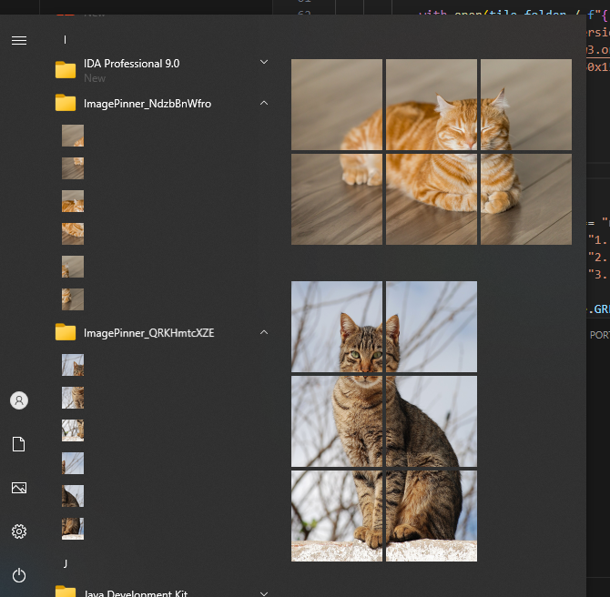

# ImagePinner

ImagePinner is a tool for creating and pinning images to the Windows Start Menu as interactive tiles.



## Features
- Load an image from a local file or URL
- Split the image into a grid (default: 3x2)
- Generate icons of different sizes
- Create shortcuts in the Start Menu
- Automatically configure shortcuts with icons

## Installation
1. Install the required dependencies:
   ```sh
   pip install pillow colorama requests pywin32
   ```
2. Save `ImagePinner` to a convenient location on your disk.

## Usage
1. Run the script:
   ```sh
   python image_pinner.py
   ```
2. Select an action:
   - **Open 'Start Menu' folder**
   - **Generate an image**
   - **Exit**
3. When generating an image, specify a file path or URL.
4. Enter the number of columns and rows for splitting (default: 3x2).
5. After processing, the shortcut will appear in the Start Menu.

## Requirements
- Windows 10
- Python 3.8+

## Notes
- Generated tiles are automatically saved in `AppData\Roaming\Microsoft\Windows\Start Menu\Programs\ImagePinner_xxxxxxxx`.

## License
This project is licensed under the MIT License.

